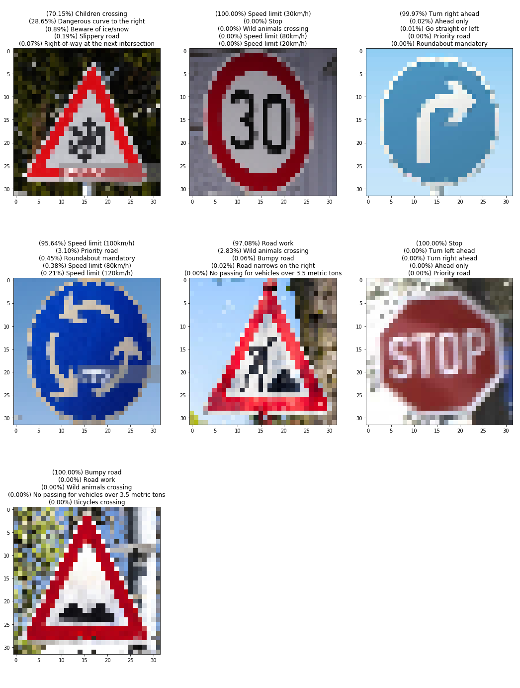

# **Traffic Sign Recognition** 

**Build a Traffic Sign Recognition Project**

The goals / steps of this project are the following:
* Load the data set (see below for links to the project data set)
* Explore, summarize and visualize the data set
* Design, train and test a model architecture
* Use the model to make predictions on new images
* Analyze the softmax probabilities of the new images
* Summarize the results with a written report

## Files Submitted

### Submission Files
1. IPython notebook with all questions answered and all code cells executed and displaying output at [Traffic_Sign_Classifier.ipynb](Traffic_Sign_Classifier.ipynb)
1. HTML export of the IPython notebook at [Traffic_Sign_Classifier.html](Traffic_Sign_Classifier.html)
1. Cropped samples of Traffic Signs obtained from Google image search in [online_samples](online_samples)

## Dataset Exploration
### Dataset Summary

| | |
|-|-|
|Number of training examples  | 34799      |
|Number of testing examples   | 12630      |
|Image data shape             | (32, 32, 3)|
|Number of classes            | 43         |

### Exploratory Visualization

#### Dataset Samples

* The dataset contains images which have very low contrast, either with very low or very high brightness. So normalization of input images is necessary

---

#### Class Distribution in Dataset

* There is a major discrepancy between the number of samples of each class, this will result that the trained network will be more accurate on classes with high number of samples and less accurate on the classes with lower samples
* The class distribution in training, validation and test data sets is very similar, so the training and validation sets are representative of the test set. Therefore, if the network does not overfit during training, the validation and test accuracy should be quite similar.

## Design and Test a Model Architecture
### Preprocessing

* Convert the input image to grayscale
* Apply Histogram equalization to enhance image contrast

### Model Architecture

| Layer		| Dimensions| Activation|Dropout| Description |
|-----------|-----------|-----------|-------|-------------|
|Input		| 32x32x1	|- 			|-		| Single Channel (Grayscale)|
|Convolution| 28x28x6   | ReLU		|N		| Conv. Filter Size: 5, Stride: 1 |
|Convolution| 24x24x16  | ReLU		|N		| Conv. Filter Size: 5, Stride: 1 |
|Fully Connected		| 120       | ReLU		|Y		| Dropout Keep Probability = 0.5 |
|Fully Connected		| 84        | ReLU		|Y		| Dropout Keep Probability = 0.5|
|Output		| 43        | -			|-		| Number of Datasaet classes = 43|

### Model Training

| Parameter             | Value					|
|-----------------------|-----------------------|
|Number of Epochs       | 40	                |
|Training Batch Size    | 64	                |
|Learning Rate          | 0.001	                |
|Optimizer				| Adam Optimizer	    |
|Loss Function			| Softmax Cross Entropy	|
|Weight initialization Mean| 0 					|
|Weight initialization Standard Deviation| 0.05 |

* Final Validation Accuracy : 0.950
* Test Accuracy 		: 0.938

### Solution Approach

* I started with the same network architecture and hyperparameters used in the LeNet Lab in Lesson 8, with changing the output layer to 43 classes instead of 10
* First I experimented with weights initialization parameters until choosing the above mentioned values, which lead to a significant improvement in the validation accuracy from the 1st epoch.
* Experimenting with convolution layer parameters (Filter size, Stride, Depth) resulted in no significant improvements.
* Removing max pooling (setting Filter Size and Stride to 1) resulted in a noticeable improvement in final validation accuracy.
* Finally, adding dropout to the fully connected layers resulted in a noticeable gain in accuracy.

## Test a Model on New Images
### Acquiring New Images

A set of Traffic Sign images were acquired from Google Image Search and cropped to focus only on the sign and remove all the surroundings.
The images chosen are mainly ones from classes with low number of samples to test the model accuracy on them

### Performance on New Images

* Prediction Accuracy: 0.7142857142857143 (5/7)
* The prediction accuracy is low compared to the validation and test accuracies since the new images were chosen of the poorly represented classes in the training set.

### Model Certainty - Softmax Probabilities

* In 1st image (Beware of Ice): The model confuses class 30 with class 28 both of which have very low sample count in the training and validation sets. The correct class is listed as third pick with very low confidence.
* In 4th image (Roundabout mandatory): The model is confused about class 40 which also has a very low sample count. The correct class is listed as third pick with very low confidence.
* For all other images the model predicts the correct class with near 100% confidence